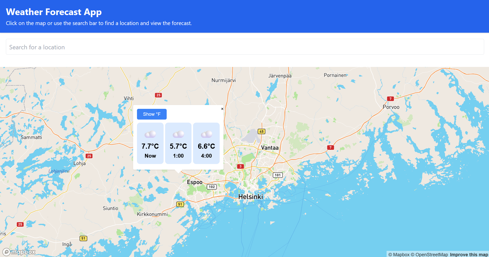

# 🌤️ Weather Forecast App

This is a React + TypeScript application that lets users explore the weather forecast for any location using an interactive map powered by Mapbox and forecast data from Open-Meteo.


## Users can:

* 🔍 Search for locations using a search bar (powered by Mapbox Geocoding API)

* 🗺️ Click on the map to select a location

* 🌡️ View hourly weather forecasts for the current time and +3 and +6 hours

* 🔁 Toggle temperature units between Celsius and Fahrenheit

## 📸 Preview



## 🛠️ Features

* Interactive map using Mapbox GL JS

* Search bar with autocomplete and location selection

* Popup forecast display on map click or location search

* Toggle temperature unit between °C and °F

* Custom-styled popups with adjustable layout

* Loading indicators with smooth UX

* ⚡ Uses api.open-meteo.com which does not require an API key

## Requirements
* NodeJs v20.17.0+
* React 19.1.0+
* Project uses npm 10.8.2+

## 📦 Installation

```
git clone https://github.com/RyazanGrove/weather-map-app.git
cd weather-map-app
npm install
```

## 🚀 Usage

First, modify .env file in the root adding your api key from MapBox (https://www.mapbox.com/):
```
VITE_MAPBOX_TOKEN= 'MAPBOX_API_KEY'
```
Then start the app:
```
npm run dev
```
and go to http://localhost:5173/

## 📁 Project Structure
```
src/
├── components/
│   ├── Header.tsx
│   ├── Map.tsx
│   ├── MapWithSearch.tsx
│   ├── Popup.tsx
│   ├── SearchBox.tsx
│   ├── ForecastDisplay.tsx
│   ├── Spinner.tsx
│   └── tests/...
├── App.tsx
└── main.tsx
```

## 🧪 Testing

* Components tested using Vitest and @testing-library/react

* Includes tests for:

  * Map

  * SearchBox

  * Popup

  * MapWithSearch

  * Header

  * ForecastDisplay

Run tests with:

```
npm run test
```